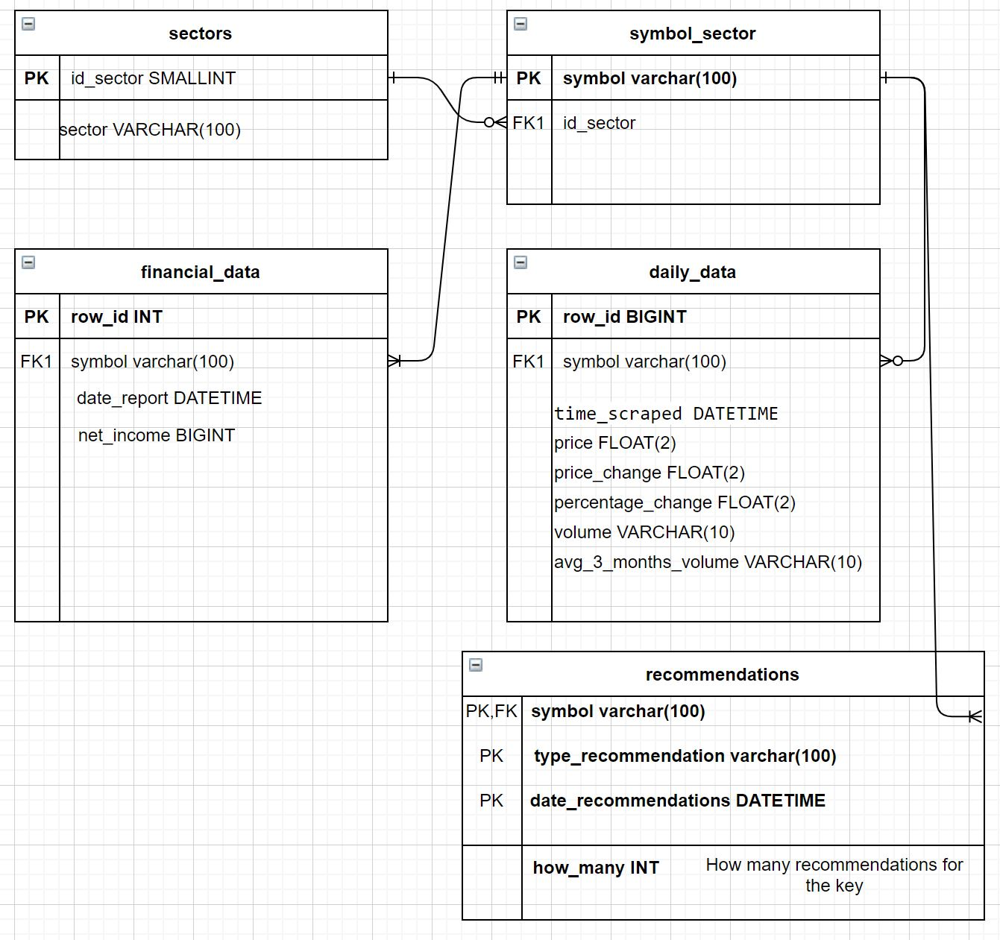

# Data Mining Project - Pulling Data From Yahoo Finance!
*Created by Bar Laniado and Anat Kira*
## What is all about
In this project we are pulling data from yahoo finance web-site: https://finance.yahoo.com/ and storing the data in our local DB.\
At the site, by pressing the Industries tab you can find a list with different sectors, like Energy, Healthcare, Technology and more...\
In each sector, we can find all the companies with their daily data: price, volume etc.\
This project focuses on obtaining the following information for each company by her symbol:
1) The stock price
2) The change in the stock price from yesterday
3) The change in the stock price from yesterday in percentages
4) Daily volume
5) Avg volume of 3 months
6) Recommendations for each symbol: StrongSell, sell, hold, buy, StrongBuy

Each target page looks like this:

Each row in the table stands for a different company represented by it's symbol, while each column contains one of the information fields above.\
\
In addition to the daily data, our scraper also able to scrape financial data for each company by it's symbol (This project focuses only on net income).\
To reach the Net Income at the web-site: press on the company symbol of your interest. Then, on the new popup page \
choose the Financials tab, scroll down in the table till you reach the row: Net Income Common Stockholders\

## The final goal
The goal of the project is to create a relational DB that contains all the collected data
pulled from yahoo finance web-site and from Yahoo Finance API.\
The program can be used to generate a significant database, containing historical data.

## The motivation
In the current times, advanced information may grant us insights regarding companies’ viability. 
By using such program, meaningful information can be extracted and stored over time, 
and allow us to compare different companies and research their performances and their recommendations. 

## Installation

Use the package manager [pip](https://pip.pypa.io/en/stable/) (version 21.0.1) to install the requests and beautifulsoup4 libraries.\
we used the versions:\
2.25.1 for requests\
4.9.3 for beautifulsoup4\
0.0.1 for bs4\
1.0.2 for PyMySQL\
**Python 3.9.0**

## Before Running the program

**Building The Database**\
Please be sure to build the DB infrastructure properly.\
Go to the db directory and run data_mining_db.sql in your MySql.\
This file will create the database and the tables that are required for running this program.

**Database configurations**\
Please go to the configurations file and change the DB connection details.\
Enter your personal information for the MySql host, user name and password:
\
HOST: The default is 'localhost'\
USER: your username\
PASSWORD: your password

**API Key**\
In order to use Yahoo Finance API one need to put the key in the HEADERS_API constant
 (HEADERS_API is located in the project_conf file). The free key give limited amount of requests.\
 For study purposes I put a free key, if you have passed the monthly limit please put a new key.

## Usage
**Command line interface**\
You can execute the program directly from the command line.\
All you need is to run our: **main_file.py**\
You can also run the program with different arguments.\
**Arguments:**\
**1) -s** \
When you specify this argument you ignore the default sectors to scrape and choose which sectors you want to be scrapped.\
The default is scraping all the sectors that exist in Yahoo-Finance:\
**"Technology", "Basic Materials", "Healthcare", "Energy", "Communication Services",
 "Consumer Cyclical", "consumer Defensive", "Financial Services", "Industrials", "Real Estate", "utilities"**.\
If for any reason you don't want to scrape all the sectors, all you need is to specify -s, immediately after all the sectors that you want to be scrapped.\
**Do you want to change the default sectors?**\
Go to the configuration file and change the SECTORS according to your needs.\
**Note:** If you specify sector that does not exist in the SECTORS list, the program will not run.\
If new sectors are created, please go to the configurations file and add to the SECTORS list the new sectors.\
**2) -d** \
Each run add logs to the logs files.\
You have the option to choose the level of the logs, you can do so by adding -d flag.\
If -d is specified as argument the logs will be in debug level (it will be more detailed).\
If -d is not specified the program logs will be in info level.\
In both cases the logs will be added to 'data_mining_info_level' file.\
**3) -f** \
The financials data are annual so there is no need to scrap them on a daily basis,
 this will increase the program’s run time. Therefore only if the flag -f is indicated the financial data will be obtained, otherwise only daily data will be obtained.\
**4) -r**\
If the flag -r is indicated the recommendations for each symbol will be obtained.

**For example:**\
In the case you want to scrape only "Technology" and "consumer Defensive" in debug mode and in addition
get the financials data and the recommendations.\
One can run the command:\
python main_file.py -s "Technology" "Consumer Defensive" -d -f -r 
## Storing The Collected Data
All the collected data is stored in a relational database.\
The database designed for the project contains 5 tables:
1. sectors - this table contains all the unique sectors.
2. symbol_sector - contains all the companies symbols and the sector's ID that each company is belong to.
3. daily_data - contains the daily stock's data.
4. financial_data  - contains the financial stock's data.
5. recommendations - contains the recommendations for each symbol. \
**ERD**
\

## The Scraper Implementation
The project is implemented by hierarchy of classes:\
\
The most basic classes are: SymbolFinancialReportData and SecurityDailyLevel and StockRecommendation.\
**SecurityDailyLevel:** creates object that contains daily data of specific symbol.\
**SymbolFinancialReportData:** creates object that contains financial data of specific symbol.\
**StockRecommendation**: creates object that contains all recommendations for a specific symbol in a specific date.\
\
In the next level there are: FinancialReportsDataScraper, DailyDataScraper and Recommendations.\
**DailyDataScraper:**  creates object that contains a list of SecurityDailyLevel objects.\
**FinancialReportsDataScraper:**  creates object that contains a list of SymbolFinancialReportData objects.\
**Recommendations:** creates object that contains a list of StockRecommendation objects.\
\
In the last level there is: MainScraperSymbols.\
**MainScraperSymbols:** creates object that contains: DailyDataScraper, FinancialReportsDataScraper and  Recommendations objects.\
\
In other words the main_file creates an object of MainScraperSymbols, this object creates the three objects: 
DailyDataScraper, FinancialReportsDataScraper and Recommendations.\
Each of these objects creates objects of: SecurityDailyLevel, SymbolFinancialReportData and  StockRecommendation respectively.

## Hope you will enjoy and start to invest in the stock market (;
# Good Luck!

