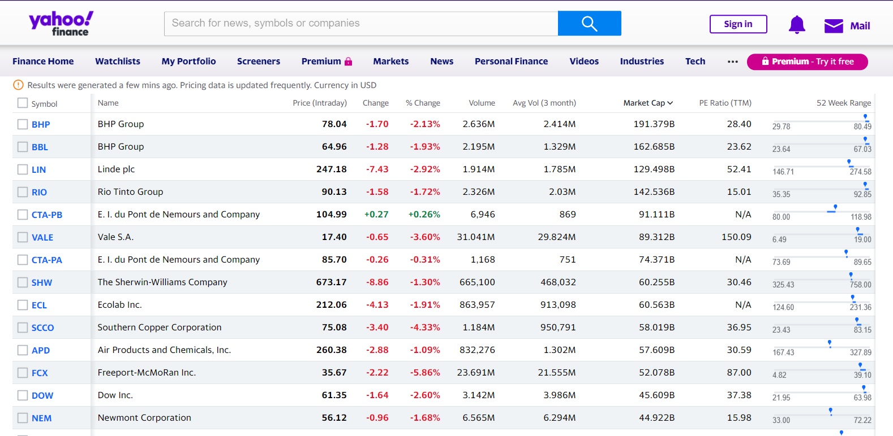
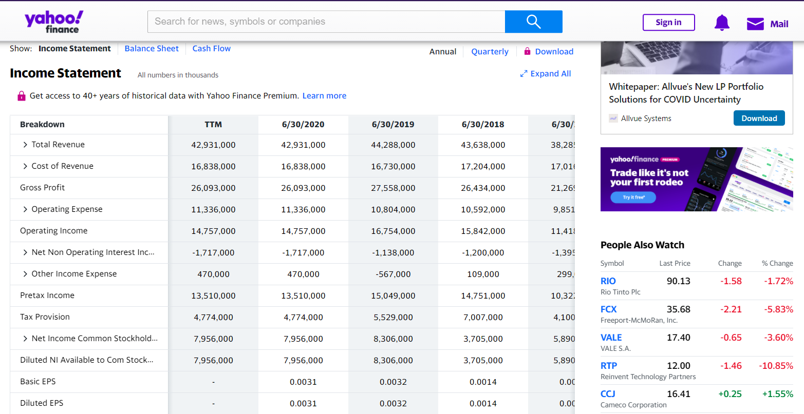

# Data Mining Project - Pulling Data From Yahoo Finance!

## Created by Bar Laniado and Anat Kira

In this project we are pulling data from yahoo finance web-site: https://finance.yahoo.com/ and store the data in out local DB.
At the site, by pressing the Industries tub you can find a list with different sectors, like Energy, Healthcare, Technology and more...\
In each sector, we can find all the companies with their daily data: price, volume...\
This project focuses on obtaining the following information for each symbol:
1) Stock price
2) Change price from yesterday
3) Change price in percentage
4) Daily volume
5) Avg volume of 3 months\
Each target page looks:

Each row in the table is a different symbol and each column contains different information.\
In addition to the daily data, our scraper also able to scrape financial data for each symbol (This project focuses only on net income).\
To reach the Net Income at the web-site: press on the company symbol by your interest, a new page will pop-up,\
choose the Financials tube, scroll down in the table till you reach the row: Net Income Common Stockholders\

## Installation

Use the package manager [pip](https://pip.pypa.io/en/stable/) (version 21.0.1) to install the requests and beautifulsoup4 libraries.\
we used the versions:\
2.25.1 for requests\
4.9.3 for beautifulsoup4, 0.0.1 for bs4\
1.0.2 for PyMySQL
**Python 3.9.0**

## Before Running
**Building The Database**\
Please take care to build the DB infrastructure properly.\
To do so: go to the db directory and run data_mining_db.sql in your MySql,\
this file will create the data base and the tables that are needed to run this program.\
**Database configutations**\
Please go to the configurations file and change the DB connection details:\
HOST = Put here the host, the default is 'localhost'\
USER: Put here your username\
PASSWORD = Put here your password\
DB = Put here the DB name, the defual is'stock_data'\
CHARSET = The defualt is'utf8mb4'\
SECTORS_TABLE = Put here the table name that will contain all the unique sectors, the default is'sectors'\
SYMBOLS_SECTORS_TABLE = Put here the table name that will contain all the unique symbols and sectors, the default is 'symbol_sector'\
DAILY_DATA_TABLE = Put here the table name that will contain all the daily data, the default is 'daily_data'\
FINANCIAL_DATA_TABLE = Put here the table name that will contain all the financial data, the default is 'financial_data'\
**Note:**
If you built the database with the file provided with this project and did not change anything,\
all you need to change in the DB configurations: USER & PASSWORD
## Usage
**Command line interface**
You can execute the program directly from the command line.\
All you need is to run our: **main_file.py**\
You can also run the program with different arguments.
**Arguments:**
**1) -s**/
When you specify this argument you ignore the default sectors to scrape and to actually determine which sectors you want to be scrapped.\
The default is to scrape all the sectors that exist in Yhaoo-Finance:\
**"Technology", "Basic Materials", "Healthcare", "Energy", "Communication Services",
"Consumer Cyclical", "consumer Defensive", "Financial Services", "Industrials", "Real Estate","utilities"**.\
If for any reason you don't want to scrape all the sectors, all you need is to specify -s and immediately after all the sectors that you want to be scrapped.\
**For example:**
Let's say I want to scrape only "Technology" and "consumer Defensive" this time.\
In order to so I have to run the command:\
python main_file.py -s  "Technology" "consumer Defensive"\
**Do you want to change the default sectors?**
Go to the configuration file and change the SECTORS according to your needs.
**Note:** If you will specify sector that does not exist in the SECTORS list, the program will not run.\
So if new sectors wil be created, please go to the configurations file and add to the SECTORS list the new sectors.
**2) -d**/
Each running adds logs to the logs files./
You have the option to choose the level of the logs, you do so by adding -d flag.\
If -d specify as argument the logs will be in debug level, this will makes the logs a lot more detailed\
and all the logs will be added to 'data_mining_debug_level' file.\
If -d not specify the program logs will be in info level and all the logs will be added to 'data_mining_info_level' file.\
**For example:**\
Let's say I want to scrape only "Technology" and "consumer Defensive" in debug mode.\
In order to so I have to run the command:\
python main_file.py -s  "Technology" "consumer Defensive" -d
**3) -f**/
The financials data are annual so there is no reason to do them scraping every day,\
too bad for running time. Therefore only if the flag -f is indicated the financial data will be obtained,\
otherwise only daily data will be obtained.\
**For example:**\
Let's say I want to scrape only "Technology" and "consumer Defensive" in info mode and I want to get the financials data also.\
In order to so I have to run the command:\
python main_file.py -s  "Technology" "consumer Defensive" -f\

## Hope you will enjoy and start to invest in the stock market (;

# Good Luck!

